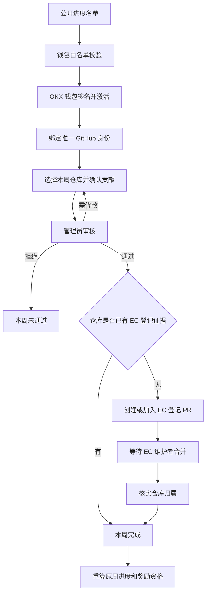
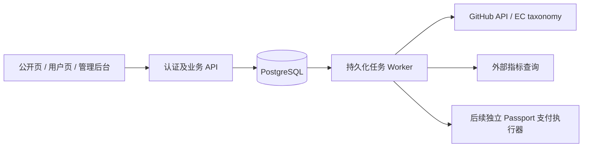

# KiteAI Bounty 看板设计文档

版本：V0.2 草案 · 更新日期：2026-09-10

依据：[README](../README.md) 与 2026-09-10 的需求对齐。用户已确认的规则优先于 README；本文标注“建议／待确认”的内容仍是设计提案。实现步骤及外部接口见 [实现文档](IMPLEMENTATION.md)。

## 1. 产品目标与交付边界

平台组织开发者持续贡献 KiteAI 相关原创代码，完成每周提交、管理员审核、EC 仓库登记和奖励资格管理。业务目标是持续形成 50+ 月活开发者，并推动 KiteAI 出现在外部开发者榜单。

MVP 交付身份认证、公开进度名单、个人提交记录、管理员审核、EC PR 自动化和奖励资格展示。实际 USDC 转账及 Agent Passport 支付执行在后续阶段交付；MVP 即使资格满足，领取功能未上线时按钮仍禁用。

### 已确认的规则

| 项目 | 规则 |
|---|---|
| 网络 | 最终使用 KiteAI 主网；开发模式支持模拟数据和测试网验证 |
| 时间 | 北京时间 `Asia/Shanghai`，2026-09-09 启动，每 7 天为一周 |
| 提交 | 每名开发者每周一次提交机会，确认本周 GitHub 仓库及贡献 |
| 审核人 | Admin 具有审核权限，确认代码有效后发起 EC PR 流程 |
| EC 延迟 | 按可能等待一周或更久设计；未合并时不能冒充已收录 |
| 奖励 | 完成至第 3 周解锁 25 USDC；依 README，第 4 周累计 40 USDC |
| 席位 | 不硬编码“仅前 50 人有奖”；实际 60 人达标时可以覆盖 60 人 |
| 发放 | 必须等待 EC PR 合并；第五周审核后开始处理，延迟合并则延迟开放 |
| 支付方向 | 后续由 KiteAI 链中心钱包向参与者发放链上 USDC，集成 Agent Passport |
| 公开范围 | 未登录可看参与者钱包及逐周完成情况；登录后可看自己的提交历史及本周待提交／已提交 |
| 额外奖励 | 本期不设计候补、优质项目额外奖励审批流程 |

“第五周审核后且 EC 条件满足”的 AND 关系是本文采用的解释；不将“已合并”解释为可在第五周前提前领取。

### 待确认的两项业务适配

| 编号 | 原始意图与约束 | 本文暂用方案 |
|---|---|---|
| D1 | 用户希望“一次成功合并到 EC 算一周”；EC 登记的对象是仓库归属，同一归属无需每周重报 | 每周审核新贡献；首次登记等 EC 合并，已登记仓库后续沿用登记证据。此规则待用户确认 |
| D2 | 原 README 是连续 3 个自然月、每月四周；现要求从 9 月 9 日开始，每周严格 7 天 | 奖励按连续四周一期，内部自然月统计另算；三个月活动的最终结束日期及后续期数待确认 |

不得通过每周建空 PR、重复 `repadd` 或新建无实质项目来满足 D1。若坚持每周必须出现新的 EC 合并事件，需要重新定义活动规则，不能由程序伪造。

## 2. 外部平台事实与可控边界

### 2.1 Electric Capital

Developer Report 官方说明：数据来自 Open Dev Data；生态是否展示有筛选规则，超过 50 月活只是资格之一，符合资格后还按全职开发者数选择前 100 个生态。其月活采用滚动 28 天；PR 合并后仍有采集、去重、处理和展示过程，不能保证立即上榜或给出固定审核时限。官方目前说明没有公开数据 API。[官方方法说明](https://www.developerreport.com/about)

本次检索上游快照 `b6ffb61ec952c3b62e02c68b98c0e6d31667b0df`，发现 `KiteAI` 已创建，历史还包含仓库增删及迁移。因此初始化时必须重放 taxonomy，不能仅搜到一条历史 `repadd` 就认定仓库当前仍在其中。[生态建立记录](https://github.com/electric-capital/open-dev-data/blob/b6ffb61ec952c3b62e02c68b98c0e6d31667b0df/migrations/2025-04-16T235959_avalanche_additions)

管理员负责本平台审核和提交申请，EC 维护者负责上游合并。后台主按钮为“审核通过并提交 EC”，已有登记则为“审核通过”；发起成功后显示真实 PR 链接与状态。[GitHub PR 接口与权限](https://docs.github.com/en/rest/pulls/pulls)

### 2.1.1 最终 EC 提交流程与责任边界

EC 提交流程按“用户提交仓库 → 后台审核 → Admin 确认提交 → GitHub App 在项目方预先 Fork 的仓库中创建独立分支 → 向 `electric-capital/open-dev-data` 创建 Pull Request → EC 审核并合并 → 后台监控并回填完成状态”执行。Fork 只在初始化时创建一次，不按参与者或每周重复创建。Admin 的按钮命名为“确认并提交 EC PR”，表示发起上游审核，不表示平台拥有官方仓库的合并权限。

系统对外部审核无法控制，但必须保证所有可控环节可追踪：提交前校验仓库和证据，审核绑定固定修订版本；每个批次和 PR 使用幂等键、独立分支及内容散列；保存 PR 编号、地址、基线、提交人和状态；外部调用失败可重试且不会重复创建；仅以 GitHub 返回的 `merged=true` 和合并后的 taxonomy 复核结果计入完成。`closed`、CI 通过、review approved 或 API 查询失败均不得视为已合并。

EC 拒绝、要求修改或延迟属于外部结果。系统保留“等待 EC”“需要修改”“已关闭未合并”等状态，不伪造完成，不阻断下一周提交；只有真实合并并逐项核实后，才回填原统计周并进入奖励资格重算。

### 2.2 Web3Insight

作为独立的外部观察数据源，提供生态、仓库与开发者查询。官网存在 API 和 MCP 入口。其返回值不能直接标成 EC 官方统计，数据刷新也不能代替 EC 合并证据。[Web3Insight 官网](https://web3insight.ai/)、[API 文档](https://api.web3insight.ai/doc/api)

产品同时保存四个不同事实：内部贡献通过、仓库已登记、外部指标已观察到、榜单已展示。任何一步成功都不自动推导后续步骤成功。

## 3. 统计周期与奖励期

首期四周日期如下，均为北京时间；区间采用包含开始、不包含结束的 `[start, end)`。

| 周次 | 开始时间 | 截止边界 | 页面显示日期 |
|---|---|---|---|
| W1 | 2026-09-09 00:00 | 2026-09-16 00:00 | 9 月 9–15 日 |
| W2 | 2026-09-16 00:00 | 2026-09-23 00:00 | 9 月 16–22 日 |
| W3 | 2026-09-23 00:00 | 2026-09-30 00:00 | 9 月 23–29 日 |
| W4 | 2026-09-30 00:00 | 2026-10-07 00:00 | 9 月 30 日–10 月 6 日 |
| 发放审核窗口 | 2026-10-07 00:00 起 | 不因 EC 延迟强制失效 | 第 5 周起处理首期奖励 |

数据库保存 UTC 时间，计算和显示按北京时间。首期开始的 UTC 值为 `2026-09-13T16:00:00Z`。后续奖励期如沿用 D2，第二期从 10 月 12 日开始，首期发放可以与第二期贡献并行。

“本月”页面默认选中当前自然月，列出与该月相交的统计周，跨月周显示完整日期范围，不把四周奖励期伪称自然月。自然月有效作者由该月实际有效 Commit 时间计算；跨月周不能全部归入提交日或审核日所在月。

## 4. 用户流程与每周一次提交

按 D1 提案执行：每人每周只有一个提交单，单内确认一个仓库；可重复使用上周仓库，但必须包含本周新的有效原创代码。登记多个项目不会增加每周提交次数。多人仓库共用登记证据，每人单独提交自己的代码证明。

用户首先填仓库链接；系统提取当前周候选 Commit，展示作者、时间及变更供确认，可补充具体 Commit／PR 链接。仅仓库 URL 存在不足以通过；候选为空时提示补充证据。PR 和 Release 需解析到实际 Commit，不能把 PR 创建者、Release 发布者直接当代码作者。

参与者可使用 AI 工具辅助开发，但必须使用本人 GitHub 身份提交并对代码负责。参与者页面只说明这一责任边界，不展示 Bot 检测字段或 Fork 历史判断规则；管理员审核时执行这些技术检查。

正式提交创建唯一记录。截止前编辑属于同一份记录的修订，不增加参与次数。已通过记录不能被用户直接改写。截止后的资料补充建议仅由 Admin 发起限时修订，仍只允许证明原周已存在的代码；这是待确认的操作细则，不能默认为允许跨周补做代码。

周末关闭新提交，不关闭 Admin 审核及 EC 同步。某周 EC 未合并不阻止下一周提交。

## 5. 状态模型

### 5.1 分开保存审核、登记与周完成状态

| 维度 | 状态 | 含义 |
|---|---|---|
| 提交审核 | `submitted / changes_requested / approved / rejected` | 本平台对固定修订版本的审核结果 |
| EC 作业 | `queued / generating / validation_failed / ready / pr_open / changes_requested / ci_failed / merged / closed_unmerged` | 批次处理过程；另存最新 CI、审核意见和同步时间 |
| 仓库登记 | `unknown / pending / verified / removed` | 经上游 taxonomy 核实的 KiteAI 归属 |
| 周完成 | `not_started / not_submitted / reviewing / changes_requested / awaiting_ec / completed / rejected / missed` | 综合审核结果及登记证据计算的页面状态 |

`completed` 条件：周内有效代码证据通过 Admin 审核，且对应仓库登记已核实；已有登记沿用历史证据。`awaiting_ec` 表示内部已通过但登记未完成。

有效代码作者必须是当前绑定的真人 GitHub 账号。审核过滤 `author.type=Bot`、以 `[bot]` 结尾的登录名、自动生成提交、Merge Commit、仅执行 Pull Request 合并的账号，以及 Fork 创建前继承的历史 Commit。系统不能可靠判断真人是否使用 AI 辅助，因此以 GitHub 作者身份、代码变更和参与者责任确认作为可验证边界。

EC PR 被关闭不等于已合并；CI 通过、review approved、可合并标记均不等于已合并。批次合并后还需逐项核实仓库是否确实包含在归属结果中，防止修改 PR 时删掉某个项目却把全批次都算成功。

### 5.2 延迟回填示例

开发者 W1 提交仓库 A，通过内部审核，登记 PR 在 W3 才合并。W1 先显示“等待 EC”；W2 可继续提交仓库 A 的新代码。合并并核实后，系统将已审核的 W1、W2 分别回填为完成，不将它们改算成 W3 的两次参与。

保存 `contributed_at`、`submitted_at`、`reviewed_at`、`ec_merged_at`、`completed_at`，并保留固定 `week_id`。回填只影响本活动资格，不宣称 EC 一定追溯统计这些历史贡献。

## 6. 页面与交互

### 6.1 公开首页 `/`

顶部显示活动说明、开始时间、北京时间、本月目标、内部有效作者进度和连接钱包按钮。核心是公开参与名单，不要求登录。

| 钱包 | 9/14–9/20 | 9/21–9/27 | 9/28–10/4 | 10/5–10/11 | 已完成周数 |
|---|---|---|---|---|---|
| `0x12…ab90` | 已完成 | 等待 EC | 待审核 | 未开始 | 1 |
| `0x34…cd12` | 未通过 | 已完成 | 本周待提交 | 未开始 | 1 |

示例为虚构占位地址。默认展示本期已参与用户，提供月份和“仅已完成”筛选；钱包缩写可复制完整公开地址。状态用文字与图标表达，不能只依赖颜色。移动端固定钱包列，横向浏览周次。

名单展示是用户已授权的产品需求。公开 API 仅返回钱包、周次和状态，不返回 OAuth 信息、内部备注、审核证据或用户邮箱。Admin 的周度细分汇总仍在后台；公开逐人状态自然可以被访问者自行汇总，不能把该汇总当保密信息。

外部榜单区展示 Developer Report／Web3Insight 链接、来源和最近观察时间。尚未读取到数据时显示“尚未确认”，请求失败显示“数据暂不可用”，均不能用 0 代替。

### 6.2 个人看板 `/dashboard`

展示钱包与 GitHub 绑定、本周日期及倒计时、“本周待提交／本周已提交”主卡、四周奖励进度、提交历史。待审核时主按钮为“查看提交”；要求修改时为“补充材料”；EC 等待状态提供真实 PR 链接。

### 6.3 本周提交 `/submissions/current`

步骤为选仓库、确认本周代码、填写完成内容和 KiteAI 集成说明、确认提交。显示“一周一份提交，修改沿用原记录”。已有登记的仓库显示“已登记，仍需审核本周贡献”。身份未绑定、非当前周、已错过截止时间时显示明确原因。

### 6.4 Admin `/admin`

| 页面 | 核心内容与操作 |
|---|---|
| 总览 | 本周内部通过人数、EC 条件满足人数、待审核人数；自然月及内部滚动 28 天作者数；奖励负债 |
| 审核队列 | 用户身份、仓库、原创代码 diff、日期、KiteAI 关联性；通过、退回、拒绝 |
| EC 中心 | 待登记项、批次、校验结果、PR、修改意见、同步时间；创建、更新、重试 |
| 奖励审核 | 每期达标名单、25／40 USDC、登记证据、待处理原因、预算与发放审批 |
| 配置 | 周期、活动方向、Admin 身份、环境状态；启动后的历史周期不可任意改动 |

管理员点击“审核通过并提交 EC”后，审核事务与后台作业分别显示结果。外部调用失败时保留已通过审核，显示登记失败并允许重试。默认以周为批次，首次操作创建 PR，同周后续新仓库更新尚未合并的 PR；已合并批次冻结，迟到审核的新仓库进入后续批次。

### 6.5 奖励 `/rewards`

显示预计、已解锁、可领取、已发放四种金额；禁用原因逐项可见。首期只完成 W1/W2 无奖励，完成至 W3 为 25 USDC，完成至 W4 累计 40 USDC。本文暂将“完成至”解释为从 W1 连续完成，缺周不自动用其他三周替代；最终规则应在开放活动前确认。

资格模型：达到对应连续周数、登记证据齐全、到第 5 周、Admin 发放审核通过。上线支付后，按钮还需支付功能启用、资金与支付服务可用、无已完成或处理中领取。60 人均获 40 USDC 时预算为 2,400 USDC；实际席位与预算由 Admin 调整，不擅自截掉第 51–60 人。

若先发 25 后达到 40，最多补发差额 15。已确认的发放记录不可被资格重算覆盖。

## 7. 系统架构与数据模型

采用模块化单体 Web/API 加独立 Worker。数据库保存事实和业务约束，Worker 执行 GitHub 同步、taxonomy 校验、PR 操作与资格重算。长任务不放在网页请求内等待完成。

| 表 | 主要内容与约束 |
|---|---|
| `users` | 规范化钱包唯一；角色、状态。链环境属于会话及部署配置，不允许换链建立重复用户 |
| `wallet_nonces / sessions / oauth_states` | 一次性挑战、会话、绑定流程；过期和单次消费 |
| `participant_invites` | Admin 导入的准入名单、联系方式、唯一钱包和激活状态 |
| `github_accounts` | GitHub 数值 ID 唯一，`user_id` 唯一；用户名只作展示 |
| `campaigns / reward_periods / campaign_weeks` | 活动与奖励期分离；周起止、时区、全局周序、期内周序 |
| `campaign_enrollments` | 已激活并绑定 GitHub 的活动参与者；活动与用户联合唯一，作为公开名单来源 |
| `repositories / project_members` | GitHub repository ID、规范化 URL 唯一；项目方向、集成说明、成员 |
| `submissions / submission_revisions` | 用户与统计周联合唯一；仓库、不可变修订、当前审核版本 |
| `contribution_evidence` | Commit SHA、作者 ID、原始时间、diff 摘要、首次观察时间；同一作者同一 SHA 不重复归属多个周 |
| `submission_reviews` | 审核针对修订版本；操作者、理由与时间，追加保存 |
| `ec_batches / ec_batch_items` | 上游仓库 ID、fork、分支、PR、文件散列、已核实项；批次与仓库联合唯一 |
| `repository_ec_registrations` | 仓库、生态、验证状态、上游快照、PR 合并证据或历史登记证据 |
| `weekly_completions` | 用户与周唯一；审核依据、登记依据、完成时间及策略版本 |
| `reward_entitlements / reward_reviews` | 用户与奖励期唯一；规则快照、解锁金额、审批、冻结原因 |
| `reward_claims / payment_attempts` | 后续支付幂等键、金额最小单位、收款钱包、资产、交易与确认状态 |
| `external_metric_snapshots` | 平台、窗口、生态、指标、采样时间、来源链接；缺失与 0 分开 |
| `jobs / outbox_events / webhook_deliveries / audit_logs` | 持久化作业、事件去重、外部回调、防重及审计 |

数据库约束、状态迁移、奖励计算均在服务端。不存在前端自行设置 Admin、完成状态或奖励金额的入口。

## 8. Agent Passport 与奖励安全边界

未来中心支付执行器必须把每笔支付绑定到服务器生成的奖励凭证；前端只能请求领取资格，不能传任意收款人、金额或 calldata。支付流程使用固定链、核实后的 USDC 合约、金额最小单位、冻结名单、每用户上限和全局预算。

Passport 官方已有钱包转账和受限会话能力，但文档将直接钱包转账与 x402 服务支付分别列出。不能假定 `wallet send` 自动受到 x402 session 的全部限制；需在支付阶段验证具体授权和限额机制后再启用。[Passport CLI](https://docs.gokite.ai/kite-agent-passport/cli-reference)

支付设计必须覆盖并发领取、nonce 重放、转账广播超时、重复回调、链重组、账号换绑和余额不足。中心钱包凭据只在独立执行器持有；代码审核服务和语言模型不获得任意支付权限。USDC 主网合约地址、精度、Passport 生产集成方式及确认数留到支付专项确定。

## 9. 设计验收

1. 未登录可以看到钱包与各周状态；登录只能读写自己的提交。
2. 同一用户一周一单；复用仓库必须有该周的新原创代码。
3. 周以北京时间严格七天计算；跨月不会改变周 ID 或把审核日期当贡献日期。
4. 管理员可审核并发起 EC PR，界面清楚标识等待 EC 维护者合并。
5. 登记 PR 延迟合并后，逐项验证并回填原周，不产生重复周数。
6. 已登记仓库按 D1 提案继续审核新贡献，不重复申请相同归属。
7. 3／4 周奖励为 25／40，支持 60 人达标；第五周前、未登记、未审核发放均不可领取。
8. 内部统计、EC 登记、EC 观察值和 Web3Insight 观察值不会混用。
9. 支付未交付时展示资格和禁用原因，不发送真实交易。

启动前需落实 D1/D2、连续周奖励细则、活动结束日期、Admin 名单和 GitHub 操作身份。这里的待确认不会阻碍搭建身份、提交、审核、公开名单及接口适配层。
